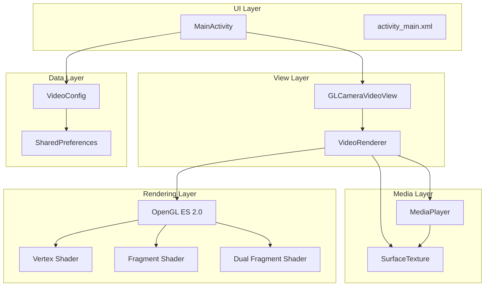
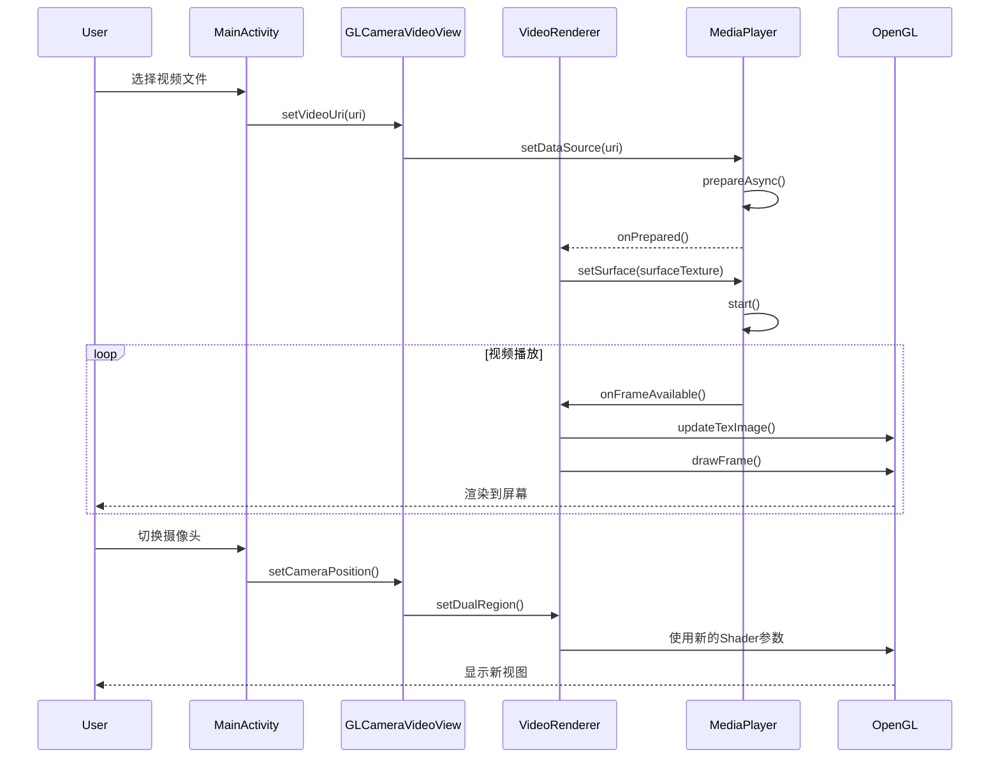
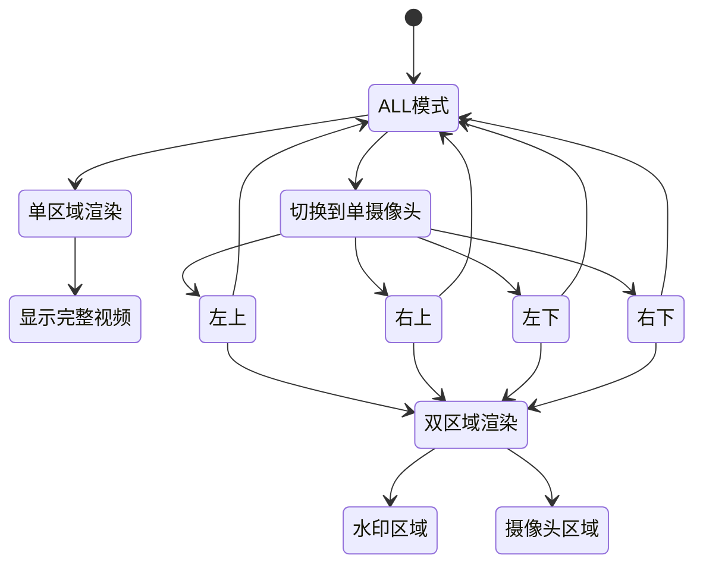
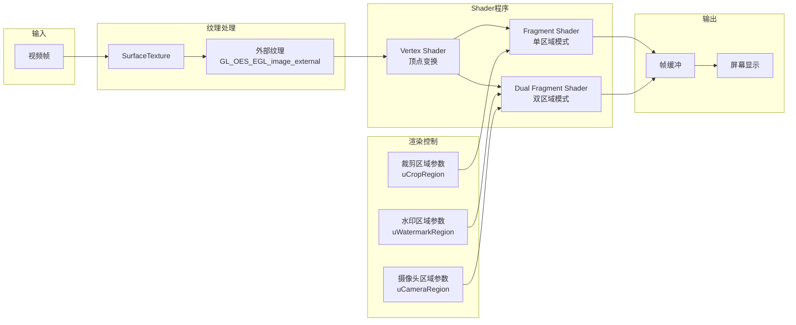
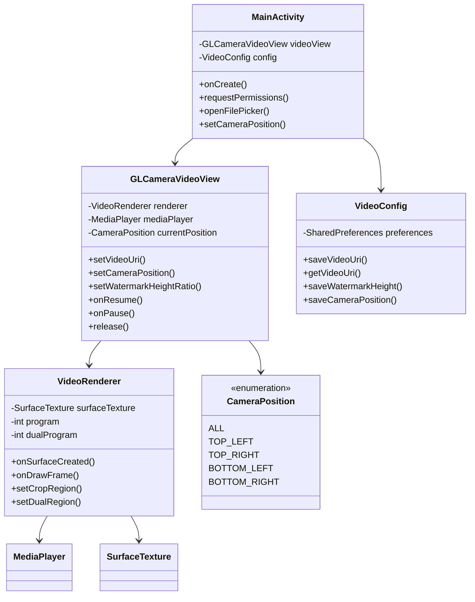
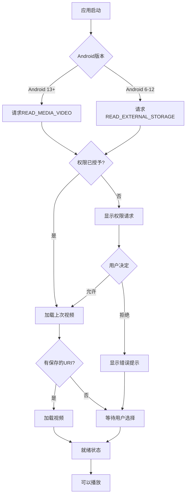

# 系统架构图

## 整体架构

```mermaid
graph TB
    subgraph "UI Layer"
        MA[MainActivity]
        AL[activity_main.xml]
    end

    subgraph "View Layer"
        GLV[GLCameraVideoView]
        VR[VideoRenderer]
    end

    subgraph "Data Layer"
        VC[VideoConfig]
        SP[SharedPreferences]
    end

    subgraph "Media Layer"
        MP[MediaPlayer]
        ST[SurfaceTexture]
    end

    subgraph "Rendering Layer"
        OGL[OpenGL ES 2.0]
        VS[Vertex Shader]
        FS[Fragment Shader]
        DFS[Dual Fragment Shader]
    end

    MA --> GLV
    MA --> VC
    GLV --> VR
    VR --> MP
    VR --> ST
    VR --> OGL
    OGL --> VS
    OGL --> FS
    OGL --> DFS
    MP --> ST
    VC --> SP
```

## 数据流程

```mermaid
sequenceDiagram
    participant User
    participant MainActivity
    participant GLCameraVideoView
    participant VideoRenderer
    participant MediaPlayer
    participant OpenGL

    User->>MainActivity: 选择视频文件
    MainActivity->>GLCameraVideoView: setVideoUri(uri)
    GLCameraVideoView->>MediaPlayer: setDataSource(uri)
    MediaPlayer->>MediaPlayer: prepareAsync()
    MediaPlayer-->>VideoRenderer: onPrepared()
    VideoRenderer->>MediaPlayer: setSurface(surfaceTexture)
    MediaPlayer->>MediaPlayer: start()

    loop 视频播放
        MediaPlayer->>VideoRenderer: onFrameAvailable()
        VideoRenderer->>OpenGL: updateTexImage()
        VideoRenderer->>OpenGL: drawFrame()
        OpenGL-->>User: 渲染到屏幕
    end

    User->>MainActivity: 切换摄像头
    MainActivity->>GLCameraVideoView: setCameraPosition()
    GLCameraVideoView->>VideoRenderer: setDualRegion()
    VideoRenderer->>OpenGL: 使用新的Shader参数
    OpenGL-->>User: 显示新视图
```

## 渲染模式切换

```mermaid
stateDiagram-v2
    [*] --> ALL模式
    ALL模式 --> 单区域渲染
    单区域渲染 --> 显示完整视频

    ALL模式 --> 切换到单摄像头
    切换到单摄像头 --> 左上
    切换到单摄像头 --> 右上
    切换到单摄像头 --> 左下
    切换到单摄像头 --> 右下

    左上 --> 双区域渲染
    右上 --> 双区域渲染
    左下 --> 双区域渲染
    右下 --> 双区域渲染

    双区域渲染 --> 水印区域
    双区域渲染 --> 摄像头区域

    左上 --> ALL模式
    右上 --> ALL模式
    左下 --> ALL模式
    右下 --> ALL模式
```

## OpenGL渲染流程

```mermaid
flowchart LR
    subgraph "输入"
        V[视频帧]
    end

    subgraph "纹理处理"
        ET[外部纹理<br/>GL_OES_EGL_image_external]
        ST[SurfaceTexture]
    end

    subgraph "Shader程序"
        VS[Vertex Shader<br/>顶点变换]
        FS1[Fragment Shader<br/>单区域模式]
        FS2[Dual Fragment Shader<br/>双区域模式]
    end

    subgraph "渲染控制"
        CR[裁剪区域参数<br/>uCropRegion]
        WR[水印区域参数<br/>uWatermarkRegion]
        CAR[摄像头区域参数<br/>uCameraRegion]
    end

    subgraph "输出"
        FB[帧缓冲]
        S[屏幕显示]
    end

    V --> ST
    ST --> ET
    ET --> VS

    VS --> FS1
    VS --> FS2

    CR --> FS1
    WR --> FS2
    CAR --> FS2

    FS1 --> FB
    FS2 --> FB
    FB --> S
```

## 组件依赖关系

```mermaid
classDiagram
    class MainActivity {
        -GLCameraVideoView videoView
        -VideoConfig config
        +onCreate()
        +requestPermissions()
        +openFilePicker()
        +setCameraPosition()
    }

    class GLCameraVideoView {
        -VideoRenderer renderer
        -MediaPlayer mediaPlayer
        -CameraPosition currentPosition
        +setVideoUri()
        +setCameraPosition()
        +setWatermarkHeightRatio()
        +onResume()
        +onPause()
        +release()
    }

    class VideoRenderer {
        -SurfaceTexture surfaceTexture
        -int program
        -int dualProgram
        +onSurfaceCreated()
        +onDrawFrame()
        +setCropRegion()
        +setDualRegion()
    }

    class VideoConfig {
        -SharedPreferences preferences
        +saveVideoUri()
        +getVideoUri()
        +saveWatermarkHeight()
        +saveCameraPosition()
    }

    class CameraPosition {
        <<enumeration>>
        ALL
        TOP_LEFT
        TOP_RIGHT
        BOTTOM_LEFT
        BOTTOM_RIGHT
    }

    MainActivity --> GLCameraVideoView
    MainActivity --> VideoConfig
    GLCameraVideoView --> VideoRenderer
    GLCameraVideoView --> CameraPosition
    VideoRenderer --> MediaPlayer
    VideoRenderer --> SurfaceTexture
```

## 权限处理流程

```mermaid
flowchart TD
    Start[应用启动] --> CheckVersion{Android版本}

    CheckVersion -->|Android 13+| ReqMedia[请求READ_MEDIA_VIDEO]
    CheckVersion -->|Android 6-12| ReqStorage[请求READ_EXTERNAL_STORAGE]

    ReqMedia --> CheckPerm{权限已授予?}
    ReqStorage --> CheckPerm

    CheckPerm -->|是| LoadLast[加载上次视频]
    CheckPerm -->|否| ShowRequest[显示权限请求]

    ShowRequest --> UserDecision{用户决定}
    UserDecision -->|允许| LoadLast
    UserDecision -->|拒绝| ShowError[显示错误提示]

    LoadLast --> HasUri{有保存的URI?}
    HasUri -->|是| LoadVideo[加载视频]
    HasUri -->|否| Wait[等待用户选择]

    LoadVideo --> Ready[就绪状态]
    Wait --> Ready
    ShowError --> Wait

    Ready --> End[可以播放]
```
